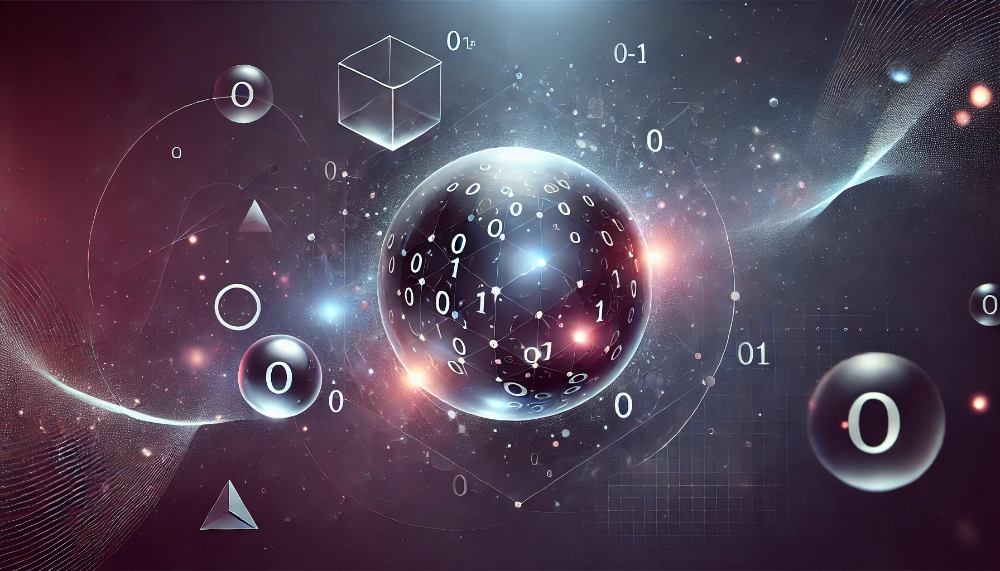

# Introduccion a la Programacion Cuantica
 Una Guia para Programadores con Experiencia

 

 La computación cuántica está revolucionando el mundo de la tecnología, prometiendo resolver problemas que, hasta ahora, eran imposibles para las computadoras clásicas. Este libro está diseñado para aquellos programadores que desean dar un paso hacia el futuro de la programación, sin importar su nivel de experiencia. Aquí aprenderás desde los conceptos fundamentales hasta la implementación práctica de algoritmos cuánticos, de una manera clara y accesible.

La computación cuántica no es simplemente una evolución de la computación clásica; es un cambio de paradigma. En lugar de operar con bits que representan únicamente ceros y unos, las computadoras cuánticas utilizan qubits, los cuales pueden estar en múltiples estados al mismo tiempo gracias a la superposición. Además, los qubits entrelazados pueden compartir información instantáneamente, sin importar la distancia que los separe, un fenómeno que ni siquiera Albert Einstein pudo explicar por completo. 

En este libro, exploraremos estos y otros conceptos de una manera progresiva. A través de ejemplos prácticos, proyectos simples y el uso de herramientas como Qiskit, aprenderás cómo crear, manipular y medir qubits. Pero más allá de la teoría, lo que hace a este libro especial es su enfoque en la simplicidad. Siguiendo la teoría del iceberg de Ernest Hemingway, solo mostraremos la parte esencial de cada concepto, dejando espacio para que descubras las maravillas ocultas debajo de la superficie.

Este es un viaje de exploración y descubrimiento, en el que aprenderás a resolver problemas usando la tecnología cuántica. Y lo mejor de todo, no necesitas ser un matemático o físico para entenderlo. Este libro está pensado para ti, el programador curioso, el entusiasta tecnológico, y para aquellos que no tienen miedo de lo desconocido.

Acompáñanos en esta aventura hacia el futuro, y prepárate para aprender algo más allá de lo imaginable: la programación cuántica.

